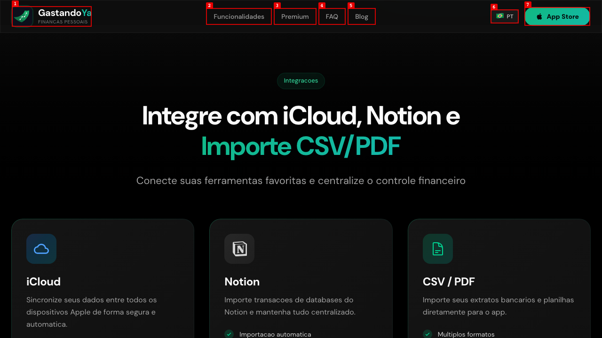
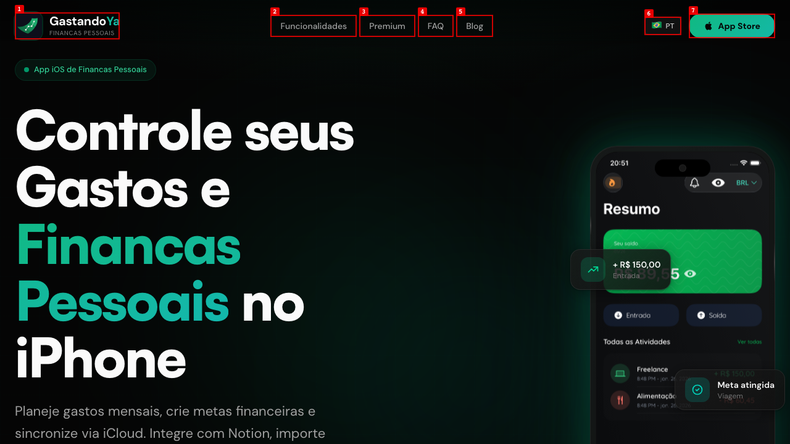
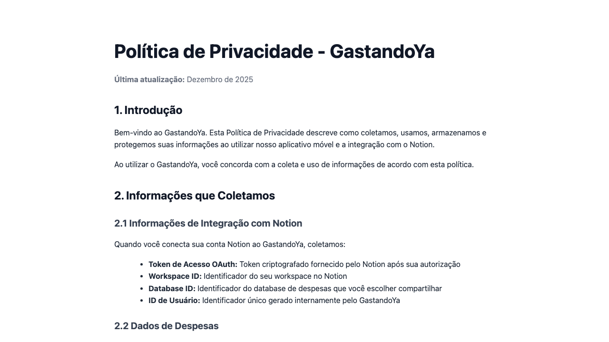
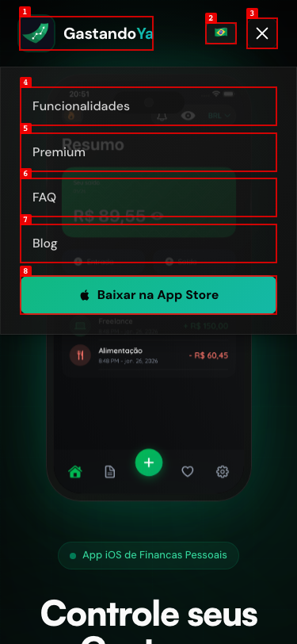

# Dogfood Report: Gastandoya

| Field | Value |
|-------|-------|
| **Date** | 2026-02-26 |
| **App URL** | https://www.gastandoya.com.br |
| **Session** | gastandoya |
| **Scope** | Full app |

## Summary

| Severity | Count |
|----------|-------|
| Critical | 0 |
| High | 2 |
| Medium | 3 |
| Low | 1 |
| **Total** | **6** |

## Issues

<!-- Copy this block for each issue found. Interactive issues need video + step-by-step screenshots. Static issues (typos, visual glitches) only need a single screenshot -- set Repro Video to N/A. -->

### ISSUE-001: Missing Portuguese diacritics (accents) across entire site

| Field | Value |
|-------|-------|
| **Severity** | medium |
| **Category** | content |
| **URL** | https://www.gastandoya.com.br |
| **Repro Video** | N/A |

**Description**

All Portuguese text on the landing page is missing diacritical marks (accents, tildes, cedillas). This affects the entire site systematically. Examples include:
- "Financas Pessoais" should be "Finanças Pessoais"
- "Integracoes" should be "Integrações"
- "Sincronizacao segura" should be "Sincronização segura"
- "transacoes" should be "transações"
- "automatica" should be "automática"
- "Importacao" should be "Importação"
- "Multiplos" should be "Múltiplos"
- "voce" should be "você"
- "informacoes" should be "informações"
- "Estatisticas" should be "Estatísticas"

This makes the site look unprofessional to native Portuguese speakers. The app screenshots within the phone mockups DO have correct accents, which creates an inconsistency.

**Repro Steps**

1. Navigate to https://www.gastandoya.com.br and observe text throughout the page.
   

---

### ISSUE-002: React hydration errors on every page load (22+ errors)

| Field | Value |
|-------|-------|
| **Severity** | high |
| **Category** | console |
| **URL** | https://www.gastandoya.com.br |
| **Repro Video** | N/A |

**Description**

Every page load produces 20+ React hydration mismatch errors in the browser console. The errors include:
- **React error #425** (repeated ~16 times): "Text content does not match server-rendered HTML" -- the server renders different text than what the client produces.
- **React error #418** (repeated ~3 times): "Hydration failed because the initial UI does not match what was rendered on the server."
- **React error #423** (repeated ~3 times): "There was an error while hydrating. Because the error happened outside of a Suspense boundary, the entire root will switch to client rendering."

This means the server-side rendered HTML doesn't match the client-side output, causing React to discard SSR and fall back to full client rendering. This likely explains ISSUE-001 (missing diacritics) -- the server may render text with accents but the client re-renders without them (or vice versa), and the hydration mismatch triggers a full client re-render.

**Impact:**
- Loss of SSR benefits (slower perceived page load, content flash)
- SEO degradation (search engines may see different content than users)
- Possible visible content flash/shift during hydration

**Repro Steps**

1. Navigate to https://www.gastandoya.com.br and open the browser developer console.
   

2. Observe 22+ React hydration errors logged in the console on initial page load.

---

### ISSUE-003: Privacy Policy and Terms of Use pages are blank on www subdomain

| Field | Value |
|-------|-------|
| **Severity** | high |
| **Category** | functional |
| **URL** | https://www.gastandoya.com.br/privacy, https://www.gastandoya.com.br/terms |
| **Repro Video** | N/A |

**Description**

Both `www.gastandoya.com.br/privacy` and `www.gastandoya.com.br/terms` render as completely blank white pages with no content, no navigation, and no page title. The actual content exists at `api.gastandoya.com.br/privacy` and `api.gastandoya.com.br/terms` (which render correctly), and the footer links do point to the API subdomain.

However, the www routes still exist and show blank pages, which is problematic:
- If anyone lands on these URLs directly (shared links, bookmarks, search engine indexing), they see a blank page
- The empty `<title>` tag and blank content will confuse search engines
- It creates the appearance that the site is broken

The privacy page content on the API subdomain is well-written and properly formatted with diacritics (unlike the landing page).

**Repro Steps**

1. Navigate to https://www.gastandoya.com.br/privacy
   

2. Navigate to https://www.gastandoya.com.br/terms
   

3. Navigate to https://api.gastandoya.com.br/privacy (for comparison -- this works)
   

---

### ISSUE-004: "Copy E-mail" button gives no visual feedback

| Field | Value |
|-------|-------|
| **Severity** | low |
| **Category** | ux |
| **URL** | https://www.gastandoya.com.br/#contact |
| **Repro Video** | videos/issue-005-repro.webm |

**Description**

When clicking the "Copiar E-mail" button in the contact section, there is no visual feedback to confirm the email address was copied to the clipboard. The button appearance doesn't change, no toast/tooltip appears, and there's no text change (e.g., "Copiado!" / "Copied!"). Users have no way to know if the action succeeded.

**Repro Steps**

1. Navigate to https://www.gastandoya.com.br and scroll to the contact section.
   

2. Click the "Copiar E-mail" button.
   

3. **Observe:** The button looks identical before and after clicking -- no feedback that the email was copied.

---

### ISSUE-005: No 404 page -- non-existent URLs show blank white screen

| Field | Value |
|-------|-------|
| **Severity** | medium |
| **Category** | functional |
| **URL** | https://www.gastandoya.com.br/nonexistent-page |
| **Repro Video** | N/A |

**Description**

Navigating to a non-existent URL shows a completely blank white page with no 404 error message, no navigation, and no way to return to the site. This is the same blank-page issue as the Privacy Policy and Terms of Use pages. There is no custom 404 page -- users who follow a broken link or mistype a URL are left stranded on a blank white screen with no indication of what happened.

**Repro Steps**

1. Navigate to https://www.gastandoya.com.br/nonexistent-page
   

2. **Observe:** Completely blank white page. No 404 message, no navigation, no way to return to the site.

---

### ISSUE-006: Mobile menu has transparent background -- content bleeds through

| Field | Value |
|-------|-------|
| **Severity** | medium |
| **Category** | visual |
| **URL** | https://www.gastandoya.com.br (mobile viewport) |
| **Repro Video** | N/A |

**Description**

On mobile viewports (375px width), the hamburger menu overlay does not have a fully opaque background. When the menu is open, the phone mockup screenshots from the hero section are visible behind the menu items ("Resumo", "R$ 89,55" visible behind "Funcionalidades" and "Premium"). This makes the menu text harder to read and looks unpolished. The menu should have a solid dark background or a proper backdrop blur.

**Repro Steps**

1. Open https://www.gastandoya.com.br on a mobile viewport (375x812) and tap the hamburger menu icon.
   

2. **Observe:** Phone mockup content ("Resumo", "R$ 89,55") is visible bleeding through behind the navigation menu items.

---
